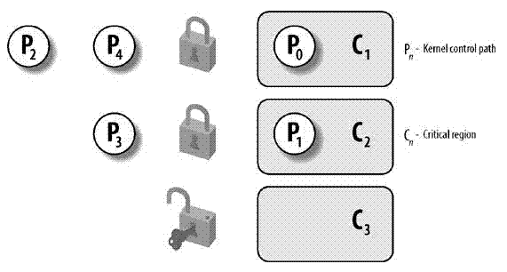
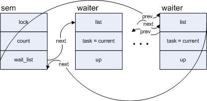

#锁🔐
> Linux作为多任务系统，能够同时运行几个进程。通常，各个进程必须尽可能独立，避免彼此打扰，这对于保护数据和确保系统稳定性很有必要，但有时候，应用程序必须彼此通信。
>

 举例来说：
**一个进程生成的数据传输到另一个进程时：**
**数据由多个进程共享时：**
**进程必须彼此等待时：**
**需要协调资源的使用时：**



##控制机制
### 竞争条件
当多个进程都企图对共享数据进行某种处理，而最后的结果又取决于进程进行的顺序时，则我们认为这发生了竞争条件。一个例子是在fork出子进程之后，父、子进程的执行顺序是不确定的，这种不确定决定了后面程序的结果，那么这便产生了一个竞争条件。
``` c
#include <stdio.h>
#include <unistd.h>
#include <stdlib.h>
 
static void charatatime(char *str)
{
    char *ptr;
    int c;
 
    setbuf(stdout, NULL);  /* 标准输出设置为不带缓冲 */
    for (ptr = str; (c = *ptr++) != 0; )
        putc(c, stdout);
}
 
int main(void)
{
    pid_t pid;
 
    pid = fork();
    if (pid == 0)
        charatatime("output from child\n");
    else
        charatatime("output from parent\n");
 
    return 0;
}
上述程序由fork产生了一个竞争条件。把标准输出的缓冲区大小设为了0，每输入一个字符就调用一次write系统调用，增大了进程运行时间，为的是让两个进程尽可能的切换。
```
运行结果：
```
output from parent
output from child
Program ended with exit code: 0
```

### 临界区
保证在某一时刻只有一个线程能访问数据的简便办法。在任意时刻只允许一个线程对共享资源进行访问。如果有多个线程试图同时访问临界区，那么在有一个线 程进入后其他所有试图访问此临界区的线程将被挂起，并一直持续到进入临界区的线程离开。临界区在被释放后，其他线程可以继续抢占，并以此达到用原子方式操 作共享资源的目的。 

### 信号量
实质上，信号量只是受保护的特别变量，能够表示为正负整数，其初始化值为1.
为操作信号量定义了两个标准操作：up 和 down，这两个操作分别用于控制关键代码范围的进入和退出，且假设相互竞争的进程方位信号量机会均等。
信号量在用户层可以正常工作，原则上可以解决内核各种锁问题，但事实上不是这样，信号量看起来容易实现，但骑开销对内核来说过大，所以内核提供了许多不同的锁和同步机制的原因。

## 内核锁机制
内核可以不受限制的方位整个地址空间，在多处理器上会有一些问题（如果几个处理器同处于核心态，理论上可以同时方位同一个数据结构），最早的解决办法是只允许一个处理器处于核心态，该方法因为效率不高，很快被废弃了。
现在内核使用了由锁组成的细颗粒度网络，来明确地保护各个数据结构。如果处理器A在操作数据结构X，则处理器B可以执行任何其他的内核操作，但不能操作X。


**读者/写折锁：**这些锁会区分对数据结构的两周不同类型的访问。任意书名的处理器都可以对数据结构进行并发访问，但只有一个处理器能够进行写访问，事实上，在进行写访问时，读访问时无法进行的。

### 原子操作

定义：这是最简单的锁操作。保证简单的操作，例如计时器+1。

#### 对整数的原子操作 

内核定义了atomic_t 类型用作计数器的原子操作基础。提供一个简单的计数器加1的例子：

1.将计数器值从内存复制到处理器寄存器；

2.将其值加1；

3.将寄存器数据回写到内存；

原子的数据结构：

```c
/*
 * This type is the placeholder for a hardware interrupt number. It has to be
 * big enough to enclose whatever representation is used by a given platform.
 */
typedef unsigned long irq_hw_number_t;

typedef struct {
	int counter;
} atomic_t;

#ifdef CONFIG_64BIT
typedef struct {
	s64 counter;
} atomic64_t;
#endif
```

文件目录：/linux-5.6.7/include/linux/types.h

原子变量只能借助`ATMIC_INIT` 宏初始化，由于原子数据类型最终是用普通的C语言类型实现的，内核将标准类型的变量封装在结构体中，所以不能使用普通运算符处理，如++

```c
typedef struct {volatile int counter;} atomic_t;
```

原子操作：

```c
//读原子变量的值
static __inline__ int atomic_read(const atomic_t *v)
{
	int t;

	__asm__ __volatile__("lwz%U1%X1 %0,%1" : "=r"(t) : "m"(v->counter));

	return t;
}

//将v设置为i
static __inline__ void atomic_set(atomic_t *v, int i)
{
	__asm__ __volatile__("stw%U0%X0 %1,%0" : "=m"(v->counter) : "r"(i));
}


```

| 接口函数                                                     | 描述                                                         |
| ------------------------------------------------------------ | ------------------------------------------------------------ |
| static inline void atomic_add(int i, atomic_t *v)            | 给一个原子变量v增加i                                         |
| static inline int atomic_add_return(int i, atomic_t *v)      | 同上，只不过将变量v的最新值返回                              |
| static inline void atomic_sub(int i, atomic_t *v)            | 给一个原子变量v减去i                                         |
| static inline int atomic_sub_return(int i, atomic_t *v)      | 同上，只不过将变量v的最新值返回                              |
| static inline int atomic_cmpxchg(atomic_t *ptr, int old, int new) | 比较old和原子变量ptr中的值，如果相等，那么就把new值赋给原子变量。 返回旧的原子变量ptr中的值 |
| atomic_inc(v)                                                | 原子变量的值加一                                             |
| atomic_inc_return(v)                                         | 同上，只不过将变量v的最新值返回                              |
| atomic_dec(v)                                                | 原子变量的值减去一                                           |
| atomic_dec_return(v)                                         | 同上，只不过将变量v的最新值返回                              |
| atomic_sub_and_test(i, v)                                    | 给一个原子变量v减去i，并判断变量v的最新值是否等于0           |
| atomic_add_negative(i,v)                                     | 给一个原子变量v增加i，并判断变量v的最新值是否是负数          |
| static inline int atomic_add_unless(atomic_t *v, int a, int u) | 只要原子变量v不等于u，那么就执行原子变量v加a的操作。 如果v不等于u，返回非0值，否则返回0值 |

 **Tips:** 原子变量很适合整数操作，但不适合比特位操作。

在ios下的原理：

```objective-c
//设置成员变量的@property属性时，默认为atomic，提供多线程安全。
//在多线程环境下，原子操作是必要的，否则有可能引起错误的结果。加了atomic，setter函数会变成下面这样：
{lock}
    if (property != newValue) { 
        [property release]; 
         property = [newValue retain]; 
    }
{unlock}
```

如果线程 A 调了 getter，与此同时线程 B 、线程 C 都调了 setter——那最后线程 A get 到的值，有3种可能：可能是 B、C set 之前原始的值，也可能是 B set 的值，也可能是 C set 的值。同时，最终这个属性的值，可能是 B set 的值，也有可能是 C set 的值。所以atomic可并不能保证对象的线程安全。

``````objective-c
		@property(atomic,assign)int number;
		//@property(nonatomic,assign)int number;


    // 1.创建队列
    NSOperationQueue *queue = [[NSOperationQueue alloc] init];
    // 2.设置最大并发操作数
    queue.maxConcurrentOperationCount =3;
    // 3.添加操作
    [queue addOperationWithBlock:^{
        self.number = self.number + 1;
    }];
    [queue addOperationWithBlock:^{
        self.number = self.number + 100;
    }];
    [queue addOperationWithBlock:^{
        NSLog(@"value:%d",self.number);
    }];
``````

打印结果：

```objective-c
value:102
```


### 自旋锁

Linux内核中最常见的锁是**自旋锁(spin lock)**.自旋锁最多只能被一个可执行线程持有。如果一个执行线程试图获得一个被争用的自旋锁，那么该线程就会一直进行忙循环，等待锁重新可用。*一个被争用的自旋锁是的请求他的线程在等待锁重新可用时自旋（特别浪费处理时间）*。这是自旋锁的要点。所以自旋锁不应该长时间持有。

#### 数据结构和用法

自旋锁通过`spinlock_t`数据结构实现(/linux-5.6.7/include/linux/spinlock_types.h)，

```c
////linux-5.6.7/include/linux/spinlock_types.h
typedef struct spinlock {
	union {
		struct raw_spinlock rlock;

#ifdef CONFIG_DEBUG_LOCK_ALLOC
# define LOCK_PADSIZE (offsetof(struct raw_spinlock, dep_map))
		struct {
			u8 __padding[LOCK_PADSIZE];
			struct lockdep_map dep_map;
		};
#endif
	};
} spinlock_t;

typedef struct raw_spinlock {
	arch_spinlock_t raw_lock;
#ifdef CONFIG_DEBUG_SPINLOCK
	unsigned int magic, owner_cpu;
	void *owner;
#endif
#ifdef CONFIG_DEBUG_LOCK_ALLOC
	struct lockdep_map dep_map;
#endif
} raw_spinlock_t;

/////linux-5.6.7/arch/arm/include/asm/spinlock_types.h
typedef struct {
	union {
		u32 slock;
		struct __raw_tickets {
#ifdef __ARMEB__
			u16 next;
			u16 owner;
#else
			u16 owner;
			u16 next;
#endif
		} tickets;
	};
} arch_spinlock_t;

#define __ARCH_SPIN_LOCK_UNLOCKED	{ { 0 } }

typedef struct {
	u32 lock;
} arch_rwlock_t;
```


####⚠️警告：自旋锁是不可递归的

Linux内核实现的自旋锁是不可递归的，这点不同于其他系统实现（ios内无此概念）。如果你试图得到一个你正持有的锁，你必须自旋，等待你自己释放这个锁。但是你已经处于自旋忙等中，所以永远没有机会释放锁，于是你被自己锁死了，千万要小心枷锁。

自旋锁当前的持有者也无法多次获得同一自旋锁！

#### ⚠️警告：单核CPU不适合使用自旋锁

单核CPU不适于使用自旋锁，这里的单核CPU指的是单核单线程的CPU，因为，在同一时间只有一个线程是处在运行状态，假设运行线程A发现无法获取锁，只能等待解锁，但因为A自身不挂起，所以那个持有锁的线程B没有办法进入运行状态，只能等到操作系统分给A的时间片用完，才能有机会被调度。这种情况下使用自旋锁的代价很高。

####读-写自旋锁

Linux下一种锁，可以允许一个或多个读任务并发的持有读者锁，相反，用于写的锁最多只能被一个写任务持有，而且不能并发的读操作。

```c
rwlock_t lock;     //定义rwlock
rwlock_init(&lock);    //初始化rwlock

//读时获取锁
read_lock(&lock);
...临界区...
read_unlock(&lock);

 //写时获取锁
write_lock_irqsave(&lock, flags);
…临界区...
write_unlock_irqrestore(&lock, flags);
```


### 信号量

信号量在创建时需要设置一个初始值，表示同时可以有几个任务可以访问该信号量保护的共享资源，初始值为1就变成互斥锁（Mutex），即同时只能有一个任务可以访问信号量保护的共享资源。

这些是用经典方法实现的，在等待信号量释放时，内核进入睡眠状态，直至被唤醒。唤醒后，内核才重新尝试获取信号量。（多个进程可以同时持有一个信号量）

由于信号量可以确保每次自由一个人进入临界区，如果临界区被占用，任务会把自己加入到等待队列上并进入休眠，所以信号量提供了更好的处理器利用率，因为没把时间花费在忙等上，但是信号量比自旋锁有更大的开销。

```c
//  /linux-5.6.7/include/linux/semaphore.h

#include <linux/list.h>
#include <linux/spinlock.h>

/* Please don't access any members of this structure directly */
struct semaphore {
	raw_spinlock_t		lock; //自旋锁
	unsigned int		count; //信号量
	struct list_head	wait_list; //
};

```

#### 1.信号量的down操作

`void down(struct semaphore *sem);`
`int down_interruptible(struct semaphore *sem);`
`int down_trylock(struct semaphore *sem);`


```c
// /linux-5.6.7/kernel/locking/semaphore.c
int down_interruptible(struct semaphore *sem)
{
	unsigned long flags;
	int result = 0;

	raw_spin_lock_irqsave(&sem->lock, flags);
	if (likely(sem->count > 0))
		sem->count--;
	else
		result = __down_interruptible(sem);
	raw_spin_unlock_irqrestore(&sem->lock, flags);

	return result;
}


```

对于需要休眠的情况，在`__down_interruptible()`函数中，会构造一个`struct semaphore_waiter`类型的变量 `struct semaphore_waiter`定义如下：

```c
// /linux-5.6.7/kernel/locking/semaphore.c


struct semaphore_waiter 
{         
        struct list_head list;         
        struct task_struct *task;         
        int up; 
};
```

```c
// /linux-5.6.7/kernel/locking/semaphore.c


static inline int __sched __down_common(struct semaphore *sem, long state,
								long timeout)
{
	struct semaphore_waiter waiter;

	list_add_tail(&waiter.list, &sem->wait_list);
	waiter.task = current;
	waiter.up = false;

	for (;;) {
		if (signal_pending_state(state, current))
			goto interrupted;
		if (unlikely(timeout <= 0))
			goto timed_out;
		__set_current_state(state);
		raw_spin_unlock_irq(&sem->lock);
		timeout = schedule_timeout(timeout);
		raw_spin_lock_irq(&sem->lock);
		if (waiter.up)
			return 0;
	}

 timed_out:
	list_del(&waiter.list);
	return -ETIME;

 interrupted:
	list_del(&waiter.list);
	return -EINTR;
}
```


将当前进程赋给task，并利用其list成员将该变量的节点加入到以`sem`中的`wait_list`为头部的一个列表中，假设有多个进程在`sem`上调用`down_interruptible`，则`sem`的`wait_list上`形成的队列如下图：




**2.信号量的V操作 (众多的down函数,但是仅需要一个up函数)**

```c
// /linux-5.6.7/kernel/locking/semaphore.c


void up(struct semaphore *sem)
{
	unsigned long flags;

	raw_spin_lock_irqsave(&sem->lock, flags);
	if (likely(list_empty(&sem->wait_list)))
		sem->count++;
	else
		__up(sem);
	raw_spin_unlock_irqrestore(&sem->lock, flags);
}
```

如果没有其他线程等待在目前即将释放的信号量上，那么只需将`count++`即可。如果有其他线程正因为等待该信号量而睡眠，那么调用`__up`.

```c
// /linux-5.6.7/kernel/locking/semaphore.c
static noinline void __sched __up(struct semaphore *sem)
{
	struct semaphore_waiter *waiter = list_first_entry(&sem->wait_list,
						struct semaphore_waiter, list);
	list_del(&waiter->list);
	waiter->up = true;
	wake_up_process(waiter->task);
}


```

demo：

```swift
        let semaphoreSignal = DispatchSemaphore(value:1)
        
        for index in 1...5 {
            DispatchQueue.global().async {
                semaphoreSignal.wait()
                print(Thread.current)
                print("这是第\(index)次执行.\n")
                semaphoreSignal.signal()
            }
            print("测试打印")
            
        }
///
测试打印
测试打印
<NSThread: 0x600000b4b100>{number = 4, name = (null)}
测试打印
这是第1次执行.

测试打印
测试打印
<NSThread: 0x600000b07640>{number = 3, name = (null)}
这是第2次执行.

<NSThread: 0x600000b58c40>{number = 6, name = (null)}
这是第3次执行.

<NSThread: 0x600000b4b100>{number = 4, name = (null)}
这是第4次执行.

<NSThread: 0x600000b7c780>{number = 7, name = (null)}
这是第5次执行.
```

```swift
        let semaphoreSignal = DispatchSemaphore(value:3)
        
        for index in 1...5 {
            DispatchQueue.global().async {
                semaphoreSignal.wait()
                print(Thread.current)
                print("这是第\(index)次执行.\n")
                semaphoreSignal.signal()
            }
            print("测试打印")
            
        }
        //////
测试打印
<NSThread: 0x600001725580>{number = 4, name = (null)}
测试打印
这是第1次执行.

测试打印
<NSThread: 0x600001750f80>{number = 5, name = (null)}
测试打印
<NSThread: 0x600001757ec0>{number = 6, name = (null)}
这是第3次执行.

<NSThread: 0x600001725580>{number = 4, name = (null)}
测试打印
这是第2次执行.

<NSThread: 0x600001760ac0>{number = 7, name = (null)}
这是第5次执行.

这是第4次执行.
```


**一些有意思的结论：**

1.由于争用信号量的进程在等待锁重新变为可用时会睡眠，所以信号量适用于锁会被长时间持有的情况。

2.相反的，锁被短时间持有时，使用信号量就不太适宜。因为睡眠，维护等待队列以及唤醒所花费的开销可能比锁被占用的全部时间还要长。

3.可以再持有信号量时去睡眠，因为其他进程试图获得同一信号量时不会因此而死锁。

4.在你占用信号量的同时不能占用自旋锁。因为在你等待信号量时可能会睡眠，而在持有自旋锁时不允许睡眠的。

####信号量与自旋锁的对比：

信号量不同于自旋锁，它不会禁止内核抢占，所以持有信号量的代码可以被抢占。这意味这信号量不会对调度的等待时间带来负面影响。

| 需求             | 建议的枷锁方式 |
| ---------------- | -------------- |
| 低开销加锁       | 优先使用自旋锁 |
| 短期锁定         | 优先使用自旋锁 |
| 长期加锁         | 优先使用信号量 |
| 中断上下文中加锁 | 使用自旋锁     |
| 持有锁需要睡眠   | 使用信号量     |

### 递归锁

NSRecursiveLock defines a lock that may be acquired multiple times by the same thread without causing a deadlock, a situation where a thread is permanently blocked waiting for itself to relinquish a lock. While the locking thread has one or more locks, all other threads are prevented from accessing the code protected by the lock.
NSRecursiveLock定义了一种锁，这种锁能够在同一个线程上多次加锁，而不会引起死锁（一个线程永远的等待自己解锁）。当被锁住的线程有一个或者多个锁的时候，其他线程就不能访问被保护的代码。

```swift
       func testRecursiveLock(){
               printPattern(n: 10)
           }
           func printPattern(n : Int) {
//               nsLock.lock()//NSLock死锁
               recursiveLock.lock()
               if n <= 0 {
                   print(n)
               }
               else {
                   print(n)
                   printPattern(n: n - 5)
                   print(n)
               }
//               nsLock.unlock()
               recursiveLock.unlock()
           }
```


### 悲观锁和乐观锁

总是假设最坏的情况，每次去拿数据的时候都认为别人会修改，所以每次在拿数据的时候都会上锁，这样别人想拿这个数据就会阻塞直到它拿到锁（**共享资源每次只给一个线程使用，其它线程阻塞，用完后再把资源转让给其它线程**）。传统的关系型数据库里边就用到了很多这种锁机制，比如行锁，表锁等，读锁，写锁等，都是在做操作之前先上锁。Java中`synchronized`和`ReentrantLock`等独占锁就是悲观锁思想的实现。

总是假设最好的情况，每次去拿数据的时候都认为别人不会修改，所以不会上锁，但是在更新的时候会判断一下在此期间别人有没有去更新这个数据，可以使用版本号机制和CAS算法实现。**乐观锁适用于多读的应用类型，这样可以提高吞吐量**，像数据库提供的类似于**write_condition机制**，其实都是提供的乐观锁。在Java中`java.util.concurrent.atomic`包下面的原子变量类就是使用了乐观锁的一种实现方式**CAS**实现的。


https://blog.csdn.net/tennysonsky/article/details/46494077

https://segmentfault.com/a/1190000016611415

https://juejin.im/post/5d554410f265da03b21532cd#heading-12

https://www.cnblogs.com/linux-37ge/p/10208369.html

